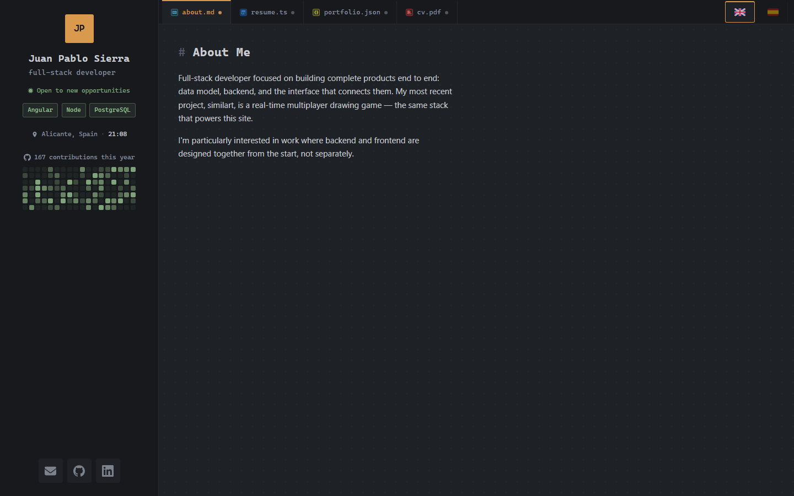
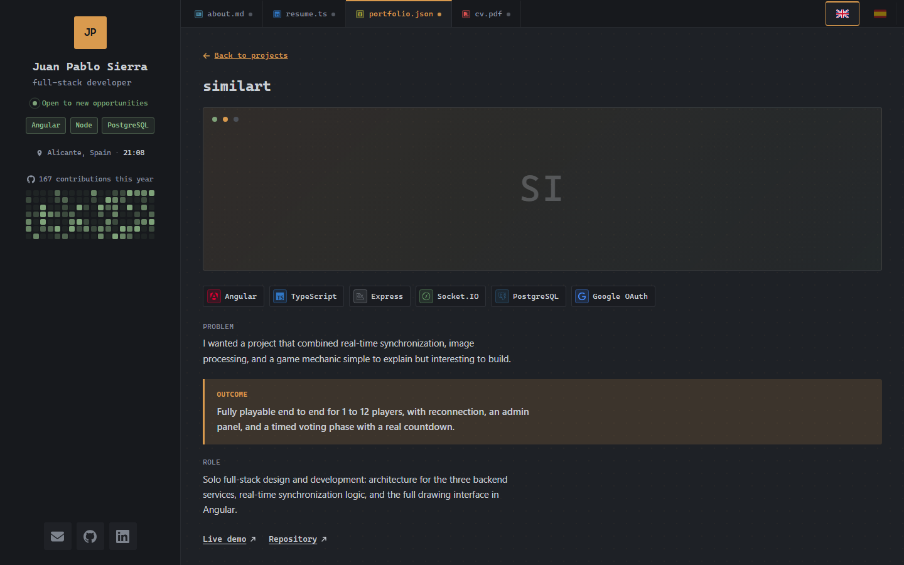
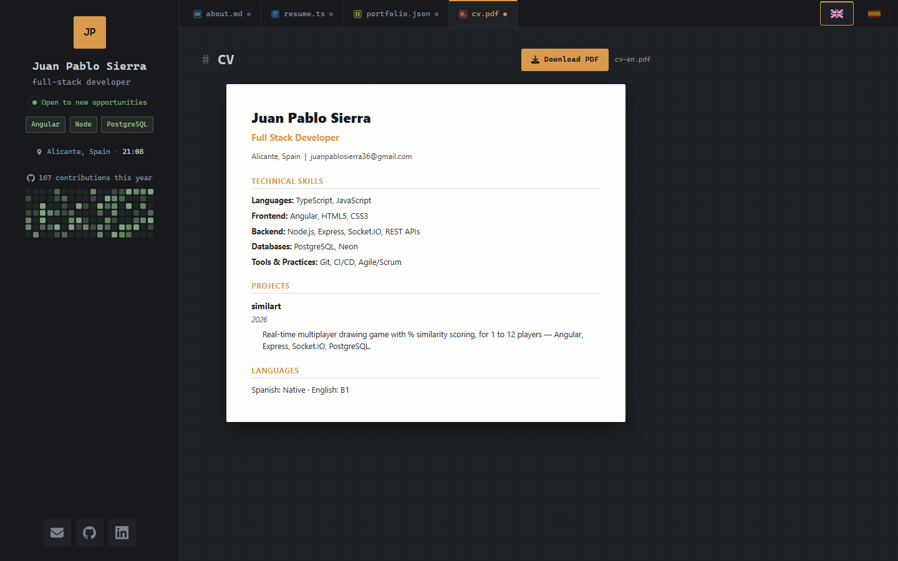
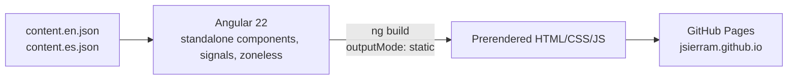
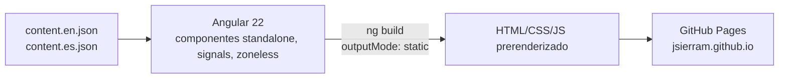

# Juan Pablo Sierra — `portfolio-app`

**[English](#english)** &nbsp;|&nbsp; **[Español](#español)**

---

## English

Personal developer portfolio, built as a fully static Angular app — no backend, no database, no authentication. The whole interface is styled like a code editor: a sidebar with identity/contact/GitHub activity, and four tabs that behave like open editor tabs, each one a different "file" (`about.md`, `resume.ts`, `portfolio.json`, `cv.pdf`).

### What is this

A single-page site meant to get its owner hired: About, a Resume with a real timeline, a Portfolio of case studies (not just a screenshot gallery — problem → outcome → role, per project), and a CV that renders as an actual downloadable document, not another styled webpage. Everything is prerendered at build time from two JSON files (English/Spanish) and served as plain static files — the same *similart* project showcased inside it is the reason the stack was worth demonstrating here too.

### Screenshots

| About + sidebar | Project case study | CV as a real document |
|---|---|---|
|  |  |  |

### What this repo does

- **About / Resume / Portfolio / CV**, navigated via a tabstrip — no Angular Router: all four "files" are just app state, which sidesteps GitHub Pages' classic SPA refresh-404 problem on a project with no need for shareable per-section URLs.
- **English/Spanish toggle**, persisted across visits — two complete, independent content files (`content.en.json` / `content.es.json`), not one file merged at runtime.
- **Portfolio**: category tabs plus 4 independent single-select filters (Frontend / Backend / Databases / Third-party services) combined with AND logic, 3 sort orders, and a full-page case-study detail view per project with real tech-stack icon chips.
- **Resume**: dotted timeline for experience/education/certifications with a "show N more" control, a spoken-languages section with flags, and a Stack section computed from the same project data — clicking a technology jumps to Portfolio pre-filtered to it.
- **CV**: a real single-page document (deliberately not the dark IDE chrome — it's what actually gets uploaded to a job portal), built from the same JSON as Resume/Portfolio. "Download PDF" points at a file chosen by the active language.
- **Sidebar**: the visitor's local time in the owner's own timezone and a GitHub contribution heatmap, both computed client-side only (Angular's `afterNextRender`) so the server-rendered and first-paint HTML never disagree with what JS fills in a moment later.
- **Tab state resets on leaving a tab, persists while you're on it** — an open project detail or an expanded timeline row goes back to default the moment you navigate away, instead of staying stuck open indefinitely.

### Architecture

No backend, no request-time rendering — everything below happens at build time.



### Stack


Angular 22, standalone components, zoneless change detection, signals for every piece of state — no NgRx, no Redux, no Router. Self-hosted font, hand-written CSS (no Bootstrap/Tailwind).

### Testing

Verified with [Playwright](https://playwright.dev/) against the real prerendered build (served over plain HTTP, never opened via `file://` — the absolute `<base href="/">` breaks script loading under the file protocol) after every change: every tab, both languages, and 3 viewport widths, checking for console/page errors and no visual regressions. Not yet a committed end-to-end suite in this repo the way *similart-app* has one — today `src/app/app.spec.ts` is the one Angular unit test in place, confirming the tabstrip renders with the right default tab.

### How to run it

```
npm install
npm start        # ng serve, port 4200
npm run build     # static prerendered output in dist/portfolio-app/browser
```

No other services needed — this is the entire stack.

### Content model

`profile` / `projects` / `experience` / `education` / `certifications` / `languages` all live in `src/app/data/content.en.json` and `content.es.json` — two complete per-language files rather than one merged at runtime: some duplication (dates, links, tech names) in exchange for each file being a single, easy-to-hand-edit unit.

**Real right now**: profile, both projects (including this site itself), spoken languages. **Still placeholder/pending, on purpose rather than invented**: career history (`experience`/`education`/`certifications` are empty arrays — those sections hide themselves entirely rather than show a heading over nothing), project screenshots, and the actual CV PDFs.

---

## Español

Portfolio personal de desarrollador, construido como una app Angular 100% estática — sin backend, sin base de datos, sin autenticación. Toda la interfaz está diseñada como un editor de código: un sidebar con identidad/contacto/actividad de GitHub, y cuatro pestañas que se comportan como pestañas abiertas de un editor, cada una un "archivo" distinto (`about.md`, `resume.ts`, `portfolio.json`, `cv.pdf`).

### Qué es esto

Un sitio de una sola página pensado para conseguir empleo a quien lo publica: About, un Resume con un recorrido real, un Portfolio de casos de estudio (no solo una galería de capturas — problema → resultado → rol, por proyecto), y un CV que se renderiza como un documento descargable de verdad, no otra página con estilo. Todo se prerenderiza en build time a partir de dos JSON (inglés/español) y se sirve como archivos estáticos planos — el propio proyecto *similart* que se muestra adentro es la razón por la que valía la pena demostrar este mismo stack acá también.

### Capturas

| About + sidebar | Caso de estudio de un proyecto | CV como documento real |
|---|---|---|
|  |  |  |

### Qué hace este repo

- **About / Resume / Portfolio / CV**, navegados por un tabstrip — sin Angular Router: los cuatro "archivos" son solo estado de la app, lo que evita el clásico problema de las SPA en GitHub Pages (404 al refrescar una ruta interna) en un proyecto que no necesita URLs propias por sección.
- **Selector de inglés/español**, persistido entre visitas — dos archivos de contenido completos e independientes (`content.en.json` / `content.es.json`), no uno solo fusionado en tiempo de ejecución.
- **Portfolio**: tabs de categoría más 4 filtros independientes de una sola elección (Frontend / Backend / Bases de datos / Servicios de terceros) combinados con lógica AND, 3 órdenes de clasificación, y una vista de detalle a pantalla completa por proyecto con chips reales de íconos de stack.
- **Resume**: timeline punteado para experiencia/educación/certificaciones con un control "ver N más", una sección de idiomas hablados con banderas, y una sección Stack calculada a partir de los mismos datos de proyectos — clic en una tecnología salta a Portfolio ya filtrado por ella.
- **CV**: un documento real de una sola página (deliberadamente no el chrome oscuro del IDE — es lo que de verdad se sube a un portal de empleo), armado con el mismo JSON que Resume/Portfolio. "Descargar PDF" apunta a un archivo elegido según el idioma activo.
- **Sidebar**: la hora local en el huso horario del dueño del sitio y un mapa de calor de contribuciones de GitHub, ambos calculados solo del lado del cliente (`afterNextRender` de Angular) para que el HTML renderizado en el servidor y el primer pintado nunca discrepen con lo que el JS completa un instante después.
- **El estado de una pestaña vuelve a su default al salir de ella, se mantiene mientras se está en ella** — un detalle de proyecto abierto o una fila de timeline expandida vuelven a su estado por defecto en cuanto se navega a otra pestaña, en vez de quedar abiertos indefinidamente.

### Arquitectura

Sin backend, sin renderizado en tiempo de request — todo lo de abajo ocurre en build time.



### Stack


Angular 22, componentes standalone, detección de cambios zoneless, signals para cada pieza de estado — sin NgRx, sin Redux, sin Router. Fuente autohospedada, CSS escrito a mano (sin Bootstrap/Tailwind).

### Pruebas

Verificado con [Playwright](https://playwright.dev/) contra el build real prerenderizado (servido por HTTP normal, nunca abierto vía `file://` — el `<base href="/">` absoluto rompe la carga de scripts bajo el protocolo de archivo) después de cada cambio: cada pestaña, los dos idiomas, y 3 anchos de viewport, comprobando que no haya errores de consola ni regresiones visuales. Todavía no es una suite end-to-end commiteada en este repo como sí la tiene *similart-app* — hoy `src/app/app.spec.ts` es la única prueba unitaria de Angular que existe, confirmando que el tabstrip renderiza con la pestaña por defecto correcta.

### Cómo arrancarlo

```
npm install
npm start        # ng serve, puerto 4200
npm run build     # salida estática prerenderizada en dist/portfolio-app/browser
```

No necesita ningún otro servicio corriendo — este es todo el stack.

### Modelo de contenido

`profile` / `projects` / `experience` / `education` / `certifications` / `languages` viven todos en `src/app/data/content.en.json` y `content.es.json` — dos archivos completos por idioma en vez de uno solo fusionado en tiempo de ejecución: algo de duplicación (fechas, links, nombres de tecnologías) a cambio de que cada archivo sea una unidad simple de editar a mano.

**Real ahora mismo**: perfil, los dos proyectos (incluido este mismo sitio), idiomas hablados. **Todavía placeholder/pendiente, a propósito y no inventado**: historial profesional (`experience`/`education`/`certifications` son arrays vacíos — esas secciones se ocultan por completo en vez de mostrar un encabezado sobre nada), capturas de los proyectos, y los PDFs reales del CV.
